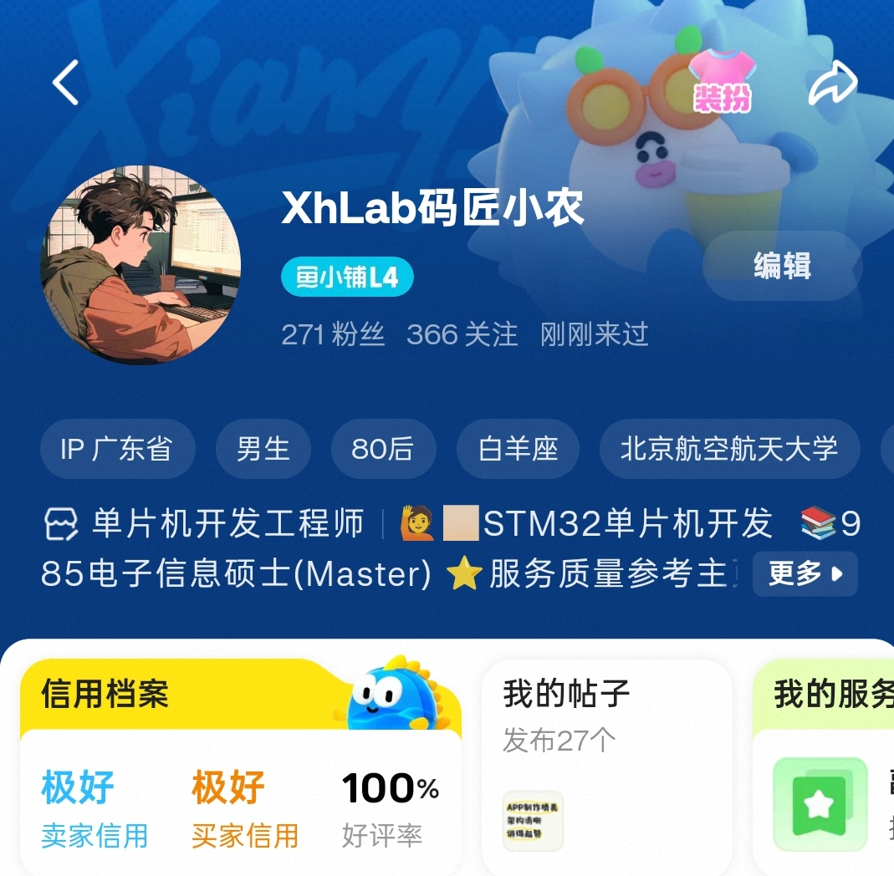
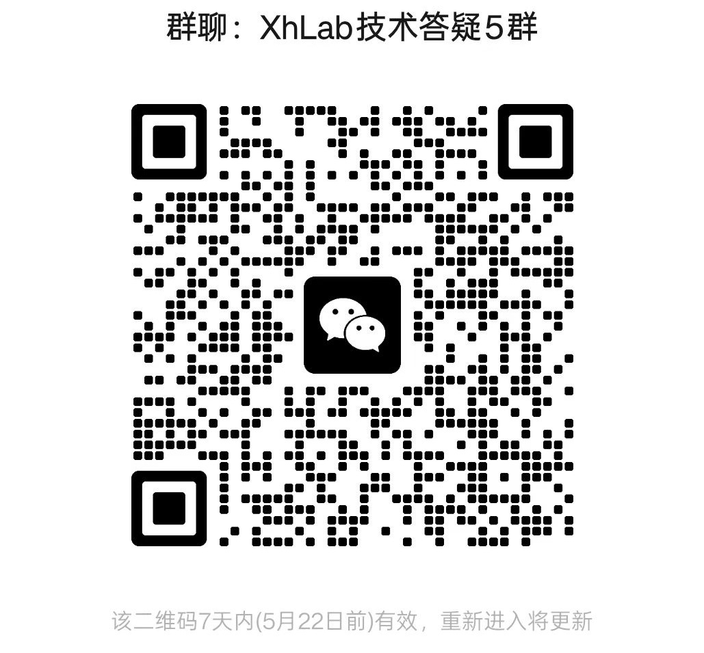

# University Course Project / Graduation Project Reference Index

**Ready-made STM32, ESP32, STC89C51/52, Arduino, microcontroller, IoT, PC software, Android APP and mini-program project references for students**

This repository is a public catalog of project references. Visitors can browse project topics, implemented functions, key materials and access status here. Project source code is paid content. After purchasing a finished project, the program source code, schematics and documentation can be provided as complimentary materials, with one-on-one Tencent Meeting walkthrough and technical guidance when needed.

**Personal homepage: <https://xhlab69.github.io/xhproject_index/>**  
You can browse categories and search keywords on the personal homepage first, find a project that fits your course design, graduation project or training work, and then contact me with the project ID to confirm materials and delivery.

> Custom development is supported. If you need additional functions, interaction changes, APP / mini-program / PC software adaptation or extra hardware modules, please contact me to confirm the requirements and implementation plan.

> Learning note: These projects are intended for learning, reference and hands-on practice. Please understand, adapt and rebuild them according to your course requirements instead of submitting them directly as assignments.

English | [中文](README.md)

---

## About This Catalog

This repository is designed as a public project index, not an open-source code repository. Each listed project has a separate private repository or project package. Source code is paid content. After purchasing a finished project, the program source code, schematics, documentation and demo materials can be provided as complimentary deliverables. One-on-one Tencent Meeting walkthrough and follow-up technical guidance can also be arranged when needed.

This is individually operated, not outsourced by a team. The operator holds a 985 university master's degree in electronic information and has years of embedded software development experience. A Xianyu shop is currently operated, where service quality reviews can be checked.

Suitable use cases:

- Course design, lab project, capstone project and graduation project topic selection
- STM32, ESP32, STC89C51/52, Arduino, microcontroller, embedded system and IoT learning
- Sensor acquisition, OLED/LCD display, Bluetooth, WiFi, cloud platform, PC software, Android APP and mini-program project references
- Report writing, function design, module division, system diagrams and program flowchart references
- Custom feature development based on existing finished projects, including module additions and software-hardware integration

## Typical Deliverables

Different projects may include different materials. The exact package should be confirmed for each project.

| Material | Description |
| --- | --- |
| Source code | STM32, ESP32, STC89C51/52, Arduino, microcontroller, ESP8266, Android APP, mini-program, PC software or related engineering files |
| Design documents | Project description, function design, module design, system diagram and flowchart |
| Hardware materials | Schematics, wiring notes, sensor/module list, PCB or simulation files for selected projects |
| Demo materials | Screenshots, running notes, debugging steps or demo video notes |
| Report references | Course design reports, thesis drafts or editable report structures for selected projects |
| Walkthrough and guidance | Tencent Meeting walkthrough, debugging explanation and follow-up technical guidance after purchasing a finished project |

## Access Policy

To prevent direct copying and uncontrolled redistribution, source repositories are not exposed in this public catalog.

1. Pick the project ID or project name from the catalog below, such as `P001`.
2. Contact me through WeChat or Xianyu and describe the materials you need, such as the finished project, source code, documents, schematics, report, APP, mini-program or PC software.
3. After the project scope, material list, price and delivery method are confirmed, purchase the finished project. The program source code, schematics and documentation can be provided as complimentary materials after purchase.
4. If you need extra functions, interaction changes, APP / mini-program / PC software adaptation or additional hardware modules, a custom development plan can be confirmed separately.
5. You may also join the technical discussion group without purchasing. Free Q&A, study guidance and technical discussion are available in the group.

> Academic note: These materials are for learning, reference and practice. Please adapt, understand and rebuild the project according to your own course requirements and your university's academic rules. Direct submission as an assignment is not recommended.

## Contact And Service Notes

Before contacting me, you can visit the personal homepage <https://xhlab69.github.io/xhproject_index/> to browse project categories and search keywords. After finding a suitable project, send the project ID, project name and required material scope so that the finished project, source code, documents, schematics, physical item or demo materials can be confirmed quickly.

| Channel | Information | Notes |
| --- | --- | --- |
| Personal homepage | <https://xhlab69.github.io/xhproject_index/> | Browse project categories and search keywords online, then contact me with the project ID after choosing a suitable project. |
| WeChat | `CamelliaRose76` | Scan the QR code or search the WeChat ID, then send the project ID to confirm the material scope. |
| Xianyu shop | `XhLab码农小匠` | View project materials, finished items, delivery notes and service quality reviews. |
| Technical discussion group | `XhLab 技术答疑群` | You can join the WeChat group without purchasing for free Q&A, study guidance and technical discussion. |

QR codes:

| WeChat | Xianyu | Technical group |
| --- | --- | --- |
|  |  |  |

## Project Catalog

| ID | Project | Implemented Functions | Key Materials / Technologies | Access |
| --- | --- | --- | --- | --- |
| 1 | STM32-based pH detection system | Real-time liquid pH monitoring, display and alarm extension. | pH sensor, STM32F103, OLED, buzzer | Paid access |
| 2 | STM32 multi-parameter environment monitoring system | Collects pressure and humidity data, displays readings and supports key and motor control. | STM32F103, pressure sensor, humidity sensor, keys, OLED, motor driver, LED | Paid access |
| 3 | Microcontroller smart water heater temperature control system | Automatic heating, constant-temperature control, OLED display and key operation. | Development board, OLED, keys, LED, heating module | Paid access |
| 4 | STM32 timer-based digital clock | Uses timers for time keeping and implements a basic digital clock display. | Timer, OLED, keys, LED | Paid access |
| 5 | STM32 WiFi IoT smart clock | Adds WiFi time synchronization and remote control to a digital clock. | Timer, WiFi module, OLED, keys | Paid access |
| 6 | STM32 serial communication data transceiver | Sends and receives serial data for device communication tests and debugging. | Serial module, development board | Paid access |
| 7 | STM32 CubeMX DC voltage detection system | Uses a development board and CubeMX configuration to detect and report DC voltage through serial communication. | ALIENTEK NANO, STM32F4, CubeMX, serial port | Paid access |
| 8 | STM32 voice-recognition smart information display | Controls OLED display content through voice commands. | STM32F103RCT6, LD3320A, 7-pin OLED, SPI | Paid access |
| 9 | STM32 electronic password lock | Runs password verification on an embedded board and supports host-side unlocking logic. | PC decoding, Wildfire board, F103C8, potentiometer, smoke sensor | Paid access |
| 10 | STM32 ambient light and temperature-humidity sensing system | Uses a potentiometer and smoke sensor to monitor environmental states. | F103C8, potentiometer, smoke sensor | Paid access |
| 11 | STM32 multi-sensor air quality monitor | Integrates multiple gas sensors for harmful gas detection. | STM32F103, MQ4, MQ5, ESP01S, fan, OLED | Paid access |
| 12 | STM32 multi-position servo control system | Controls six servos for multi-degree-of-freedom motion, suitable for robots or robotic arms. | STM32F103C8T6, MG90S, serial module, PWM, keys | Paid access |
| 13 | STM32 dual-channel DAC/PWM signal output system | Generates analog output and PWM signals for waveform and motor-control experiments. | F103, dual DAC, dual PWM, keys | Paid access |
| 14 | STM32 Bluetooth stepper motor remote control system | Controls a stepper motor through Bluetooth APP and integrates temperature, humidity, weight and LED display. | F103, stepper motor, HC-05, LEDs, OLED, DHT11, HX711, buttons, Bluetooth APP | Paid access |
| 15 | Infrared remote dual-motor speed control system | Uses infrared remote control for independent control of two servos or motors. | F103, ASR board, OLED, two servos, infrared switch | Paid access |
| 16 | STM32 Aliyun greenhouse environment monitoring system | Collects temperature, humidity, pressure and light data and uploads it for cloud visualization. | STM32F103, ESP01S, temperature/humidity, pressure, light, OLED, Aliyun | Paid access |
| 17 | STM32 four-axis robot servo control system | Controls a four-axis robot and connects to a mini-program for interaction. | ESP32C3, four-axis robot, mini-program | Paid access |
| 18 | STM32 multi-vital-sign monitoring system | Collects GPS, heart rate, SpO2, motion and temperature-humidity data. | NEO-6M GPS, MAX30102, MPU6050, buzzer, DHT11 | Paid access |
| 19 | Smart agriculture scheduled irrigation control system | Detects soil moisture, light intensity and time data to control irrigation automatically. | PCB, dual MCU, WiFi, soil moisture, light, DS18B20, water pump, relay, RTC | Paid access |
| 20 | Infrared remote automatic curtain control system | Controls curtain opening and closing with infrared remote control, temperature-humidity sensing and voice broadcast. | Curtain model, F1 board, 1838 IR, stepper motor, DHT11, light sensor, keys, JQ8900 | Paid access |
| 21 | STM32 fingerprint Bluetooth access control system | Uses fingerprint recognition and Bluetooth communication for secure identity verification and remote control. | F103, AS608 fingerprint, HC-05, DHT11, buzzer, OLED | Paid access |
| 22 | STM32 voice-triggered safety alarm system | Provides voice prompts and alarms with light, water level and infrared detection. | F103, JQ8900, water level module, light module, IR module, LED | Paid access |
| 23 | STM32 wearable multi-vital-sign wristband | Integrates heart rate, SpO2, temperature, smoke and motion sensing for health monitoring. | F103, OneNET, MAX30102, DS18B20, smoke sensor, OLED, MPU6050, ESP01S | Paid access |
| 24 | STM32 RTOS real-time environment monitoring system | Uses RT-Thread to manage multiple monitoring tasks for efficient data collection and processing. | F103, RT-Thread, MQ2, DHT11, buzzer, ESP01S, NEO-6M GPS | Paid access |
| 25 | STM32 modular embedded system program design | Shows a complete embedded development process with system framework and program flowcharts. | F103, strain gauge, OLED, Visio system diagrams, flowcharts | Paid access |
| 26 | STM32 cloud-based smart agriculture remote monitoring system | Connects a WeChat mini-program and OneNET to monitor soil, light and water remotely. | STM32, UniApp, mini-program, OneNET, sensors, relay, Hall voltage module | Paid access |
| 27 | STM32 infrared flame detection and automatic alarm system | Combines infrared and smoke sensors for fire warning and alarm control. | F103, E18-D80NK, OLED, JQ8900, HC-05, flame sensor, APP, relay | Paid access |
| 28 | STM32 smart water flow metering and control system | Detects water level, turbidity and pH, and supports cloud remote monitoring. | F103, OneNET, UniApp, pump, DS18B20, pH, turbidity, buzzer, OLED | Paid access |
| 29 | STM32 automatic pet feeder and environment monitor | Performs scheduled feeding and monitors pet environment through wind and gas sensors with cloud access. | F103, wind sensor, MQ4, MQ7, ESP01S, DHT11, Aliyun | Paid access |
| 30 | STM32 smart pet feeding and environment monitoring system | Combines feeding, gas, light, sound and actuator modules for pet environment management. | F103, keys, ESP01S, Aliyun, DHT11, OLED, MQ2, buzzer, IR, JQ8900, SG90 | Paid access |
| 31 | STM32 OneNET dust concentration monitoring system | Collects dust, temperature-humidity and light data and uploads it to OneNET. | F103, ESP01S, MPU6050, AT24CXX, EEPROM, DS18B20, buzzer, pressure sensor | Paid access |
| 32 | STM32 multi-source indoor environment monitoring system | Integrates dust, temperature, light, voice, fan and servo modules for linked control. | F103, UniApp, Android APP, ESP01S, ZPH01, MLX90614, JQ8900, OneNET, fan, SG90, OLED | Paid access |
| 33 | STM32 voice-recognition smart home control terminal | Uses voice commands to control lights, fans, motors and display modules. | OLED, TTS, ESP01S, DHT11, Aliyun, JQ8900, light sensor, speaker | Paid access |
| 34 | STM32 offline voice smart device control system | Optimizes and extends a smart device control system for better stability and practicality. | Smart car, F103, OLED, MQ2, DHT11, flame sensor, ESP01S, Aliyun | Paid access |
| 35 | STM32 HAL local voice recognition system | Uses HAL and CubeMX for WiFi connection, voice recognition and PIR detection. | HAL, CubeMX, OLED, WiFi, Aliyun, ASRPRO, HC-05, PWM light, PIR, keys | Paid access |
| 36 | STM32 Aliyun indoor CO2 monitoring system | Collects CO2, temperature, humidity and light data and supports APP remote viewing. | F103, light sensor, JW01 CO2 sensor, DHT11, ESP01S, Aliyun, APP | Paid access |
| 37 | STM32 pedometer with three-axis sensor | Uses step counting and GPS to record movement traces and health data. | F103, MPU6050, step algorithm, fall detection, NEO-6M, DS18B20, ESP01S, MAX30102, OneNET | Paid access |
| 38 | STM32 smart agricultural greenhouse monitoring system | Monitors pH, TDS, soil moisture, water temperature and cloud communication. | STM32, pH, TDS, soil moisture, DS18B20, ESP01S, Aliyun | Paid access |
| 39 | STM32 Aliyun indoor air quality monitor | Detects PM2.5, methanol, formaldehyde, CO2 and temperature-humidity with cloud upload. | Development board, LCD, gas sensors, SP30 CO2, DHT11, ESP01S, Aliyun | Paid access |
| 40 | STM32 voice-recognition smart sorting bin | Uses voice commands to control a smart bin, with light and smoke sensing. | Smart car base, servo bin, ASRPRO, L298N, HC-05, light sensor | Paid access |
| 41 | STM32 distributed smart environment monitoring node | Collects temperature, smoke, light and display data with cloud upload and remote monitoring. | STM32F103, DHT11, MQ2, SR06 IR, ESP01S, OLED, Aliyun, buzzer, LED | Paid access |
| 42 | STM32 OneNET agricultural greenhouse monitoring system | Collects light, soil moisture and water level data and uploads it to OneNET. | F103, DHT11, light, soil moisture, OneNET, UniApp, ESP01S, JW01 | Paid access |
| 43 | Smart fish tank scheduled feeding and circulation system | Handles scheduled feeding, water level control, PVC heating and buzzer alarms. | F103, relay pump, ESP01S, PVC heating, buzzer, OLED, Aliyun, DS18B20, turbidity, stepper motor | Paid access |
| 44 | STM32 alcohol detection and alarm system | Detects alcohol concentration and shows alarm status through OLED and buzzer. | F103C6T6, MQ3, buzzer, OLED, report | Paid access |
| 45 | STM32 supermarket entrance people counting and anti-theft system | Implements line tracking, ultrasonic obstacle avoidance, Bluetooth control and PC GUI display. | STM32 car, IR tracking, ultrasonic, Bluetooth, PCB, report | Paid access |
| 46 | Infrared learning universal remote controller | Uses IR and CH340 serial communication, with a Python script for PC volume/control actions. | F103, Python PC tool, HC-05, APP, CH340 serial board | Paid access |
| 47 | STM32 ultrasonic ranging and environment application system | Combines ultrasonic ranging, smoke, temperature, WiFi and cloud functions. | F103, MQ2, DHT11, ultrasonic sensor, ESP01S, Aliyun | Paid access |
| 48 | STM32 smart security monitoring node | Supports local and remote control with PIR, WiFi and cloud platforms. | F103, HCSR501, ESP01S, Aliyun, OneNET, UniApp, Android APP | Paid access |
| 49 | STM32 smart air purifier control system | Monitors TVOC, CO2, formaldehyde, light and water level and controls fan, pump and heater. | STM32F1, ESP01S, TVOC, CO2, JW01, DHT11, Aliyun APP, pump, buzzer, fan, heater | Paid access |
| 50 | STM32 Bluetooth smart LED dimming system | Uses a mobile APP to control lighting, fan, sensors and cloud-linked thresholds. | F103, stepper motor, L9110 fan, DHT11, ESP01S, Aliyun, relay pump, OLED, buzzer, JW01 | Paid access |
| 51 | STM32 adaptive light adjustment system | Implements light sensing, filtering, smoke detection and cloud upload. | F103, light control circuit, ESP01S, Aliyun, MQ2, DHT11 | Paid access |
| 52 | STM32 MPU6050 motion health wristband | Performs attitude calculation, complementary filtering, OLED display and cloud upload. | F103, MAX30102, MPU6050, Mahony filter, OLED, DS18B20, ESP01S, Aliyun | Paid access |
| 53 | STM32 JW01 formaldehyde detector | Collects gas and temperature-humidity data and displays it through an STM32 system. | JW01 gas sensor, DHT11, STM32F103 board | Paid access |
| 54 | STM32 WiFi APP smart home environment monitor | Collects temperature, humidity, smoke and light data and controls fan and relay through a mobile APP. | OLED, DHT11, MQ2, light sensor, relay, WiFi APP | Paid access |
| 55 | STM32 ADC voltage acquisition and ultrasonic ranging system | Provides key control, ADC voltage sampling and ultrasonic distance measurement. | STM32, ADC, HC-SR04, keys | Paid access |
| 56 | STM32 SIM remote data transmission system | Links STM32 with a SIM module for SMS alarms, remote collection or IoT communication. | SIM module, STM32, serial communication | Paid access |
| 57 | SHT31 indoor temperature-humidity monitor | Collects temperature and humidity data and communicates through IIC. | SHT31, IIC, STM32 | Paid access |
| 58 | Infrared and light sensor environment display system | Detects infrared events and light level and displays data on OLED. | IR sensor, light sensor, OLED, STM32 | Paid access |
| 59 | STM32 three-channel ADC and PSD ranging system | Performs multi-channel analog acquisition and distance measurement. | ADC, PSD distance sensor, STM32 | Paid access |
| 60 | AD5933 impedance measurement and analysis system | Measures, processes and displays impedance parameters for material or bio-impedance scenarios. | AD5933, IIC, STM32, impedance measurement | Paid access |
| 61 | STM32F407 multi-attitude and eight-channel data acquisition system | Integrates attitude sensors and multi-channel ADC acquisition for motion and analog signal monitoring. | STM32F407, MPU6050, 8-channel ADC | Paid access |
| 62 | OneNET cloud temperature-humidity IoT monitor | Uploads environmental data to a cloud platform through MQTT. | OneNET, MQTT, DHT11, STM32 | Paid access |
| 63 | STM32 multifunction environment monitoring and interaction system | Integrates display, clock, storage, serial communication and temperature-humidity acquisition. | TFTLCD, RTC, EEPROM, DHT11, serial port | Paid access |
| 64 | STM32 low-power data acquisition and Flash storage system | Supports AD acquisition, low-power operation and local Flash data storage. | ADC, Flash, low power, STM32 | Paid access |
| 65 | STM32 dual-DAC output and ADC acquisition system | Provides two-channel analog output and input acquisition for signal generation and capture. | DAC, ADC, STM32 | Paid access |
| 66 | Serial-controlled 42 stepper motor driver system | Controls stepper motor direction, speed and angle through serial commands. | 42 stepper motor, serial port, STM32 | Paid access |
| 67 | PC-based serial temperature-humidity monitoring system | Uploads sensor data from the MCU to a PC for real-time display and review. | DHT11, serial communication, PC software, STM32 | Paid access |
| 68 | STM32 dual-ADC acquisition and stepper motor control system | Combines dual-channel sampling with motor control. | ADC, stepper motor, STM32 | Paid access |
| 69 | STM32 integrated light, servo and motor control system | Controls LED, servo and DC motor linkage for smart car or actuator demos. | LED, servo, motor, PWM | Paid access |
| 70 | LM386 sound signal acquisition and analysis system | Samples audio analog signals through ADC for noise or sound-control applications. | LM386, ADC, STM32 | Paid access |
| 71 | Multi-sensor indoor environment safety monitor | Collects temperature, humidity and smoke concentration and supports alarm expansion. | DS18B20, DHT11, MQ2, STM32 | Paid access |
| 72 | STM32 temperature, smoke, flame and voice alarm system | Detects temperature, smoke and flame and drives stepper motor and voice alarm modules. | Temperature sensor, MQ2, flame sensor, ULN2003, voice module | Paid access |
| 73 | STM32 16-channel ADC data acquisition system | Performs multi-channel analog signal acquisition for industrial or lab data logging. | 16-channel ADC, STM32 | Paid access |
| 74 | STM32F4 formaldehyde gas detection and Bluetooth transmission system | Collects formaldehyde data and sends it through Bluetooth. | STM32F4, formaldehyde sensor, HC-06 | Paid access |
| 75 | Ultrasonic distance measurement system | Measures distance for obstacle avoidance, liquid level or ranging scenarios. | IOE-SR05, STM32, timer | Paid access |
| 76 | STM32 ultraviolet detection and temperature-control actuator system | Displays data on OLED, indicates states with LEDs and controls heating/cooling. | OLED, UV sensor, LED, heating/cooling module | Paid access |
| 77 | STM32F407 smart lighting and environment sensing control system | Uses infrared, ultrasonic and light sensing with PWM LED brightness control. | STM32F407, IR sensor, ultrasonic, LDR, PWM | Paid access |
| 78 | STM32 PC clock, alarm and OLED display system | Implements RTC clock, alarm settings, serial communication and OLED interaction. | DS1302, OLED, CH340, PC software | Paid access |
| 79 | MAX30102 heart rate and SpO2 acquisition with OLED waveform | Collects heart rate and SpO2 data and displays waveform and parameters on OLED. | MAX30102, OLED, STM32 | Paid access |
| 80 | PC-based 18-channel data acquisition and visualization system | Uploads multi-channel data through serial communication for PC visualization. | 18-channel acquisition, serial port, PC software | Paid access |
| 81 | Electric energy metering and monitoring system | Collects voltage, current and power data for energy monitoring and analysis. | Energy metering module, STM32, serial port | Paid access |
| 82 | Load-cell electronic scale measurement system | Acquires, filters and displays weight data. | Load cell, ADC, STM32 | Paid access |
| 83 | Relay timer and power calculation system | Controls timed relay switching and calculates load runtime or energy data. | Relay, timer, power calculation, STM32 | Paid access |
| 84 | Voice-interactive stepper motor and OLED system | Controls stepper motor actions through a voice module and displays status on OLED. | Voice module, OLED, stepper motor, SRF06 | Paid access |
| 85 | STM32 elevator environment sensing and servo control system | Simulates elevator environment detection and door control using PIR, temperature-humidity and servo. | SG90, DHT11, OLED, PIR sensor | Paid access |
| 86 | OneNET multi-sensor smart environment monitoring system | Uploads temperature, smoke, light and flame data to the cloud and supports relay linkage. | OneNET, DHT11, MQ2, light sensor, flame sensor, relay | Paid access |
| 87 | STM32F4 health monitoring and attitude detection system | Integrates heart rate, SpO2, attitude detection and OLED display. | STM32F4, MAX30102, MPU6050, OLED | Paid access |
| 88 | APP-controlled smart water level and voice actuator system | Links APP control with water level detection, voice prompt and servo action. | STM32F407, APP, voice module, water level sensor, SG90 | Paid access |
| 89 | STM32 SD card data storage and file management system | Reads and writes SD card data for offline data logging and file management. | SD card, SPI, STM32 | Paid access |
| 90 | PC-based four-channel ADC data visualization system | Samples four analog channels and displays waveforms and values on a PC. | Four-channel ADC, serial port, PC software, STM32 | Paid access |
| 91 | LCD1602 multi-parameter environment alarm system | Collects temperature-humidity, liquid level and pressure data with buzzer alarm. | LCD1602, sensors, buzzer | Paid access |
| 92 | MPU6050 and ESP01S wireless attitude monitoring system | Collects attitude data and transmits it wirelessly with OLED status display. | MPU6050, ESP01S, OLED, STM32 | Paid access |
| 93 | STM32 smart dormitory environment monitoring system | Collects dormitory environment data, controls devices and displays system status for smart-home style projects. | STM32, sensors, OLED, relay | Paid access |
| 94 | STM32 smart voice garbage bin system | Implements voice interaction, automatic lid opening and status prompts. | Voice module, servo, sensors, STM32 | Paid access |
| 95 | STM32 aquaculture environment monitoring and control system | Monitors aquaculture environment and controls alarms and actuators. | Water level/environment sensors, relay, STM32 | Paid access |
| 96 | STM32 sound-aware environment monitoring system | Combines sound detection and environmental sensing for security or abnormal-sound alarms. | Sound sensor, STM32, OLED | Paid access |
| 97 | PC-based five-channel ADC data acquisition system | Performs five-channel sampling and real-time PC curve display. | Five-channel ADC, STM32, PC software | Paid access |
| 98 | Matrix sensor network PC monitoring system | Collects matrix sensor data and manages it through serial communication and PC visualization. | Matrix acquisition, PC software, STM32 | Paid access |
| 99 | STM32F4 HC-05 Bluetooth communication control system | Implements Bluetooth communication for mobile control and wireless data transmission. | HC-05, STM32F4, serial communication | Paid access |
| 100 | STM32 digital oscilloscope | Samples analog signals, displays waveforms and analyzes basic parameters. | ADC, timer, OLED/LCD, STM32 | Paid access |
| 101 | STM32 ADC-DAC digital filtering experiment platform | Performs signal acquisition, DAC output and FIR/IIR digital filtering. | ADC, DAC, FIR, IIR, STM32 | Paid access |
| 102 | RS485 industrial data acquisition system | Uses ADC acquisition, timer trigger, DMA transmission and RS485 communication. | ADC, DMA, RS485, STM32 | Paid access |
| 103 | STM32 frequency meter and square-wave acquisition system | Measures square-wave frequency and displays signal parameters. | Frequency meter, timer, ADC, STM32 | Paid access |
| 104 | TCS3200 color recognition and serial display system | Reads color sensor data and outputs recognition results through serial communication. | TCS3200, serial port, STM32 | Paid access |
| 105 | LD3322 voice recognition control system | Provides offline voice recognition for embedded control scenarios. | LD3322, STM32, voice recognition | Paid access |
| 106 | RGB lighting PC control system | Sends PC commands to control RGB LED color and brightness. | RGB LED, serial port, PC software, PWM | Paid access |
| 107 | HC-SR501 PIR security system | Detects human infrared signals and triggers alarms or relay actions. | HC-SR501, relay, STM32 | Paid access |
| 108 | STM32 servo-controlled electromagnetic launch experiment platform | Uses servo angle control with an electromagnetic launch structure for experiments. | STM32, servo, electromagnetic launch module | Paid access |
| 109 | STM32 smart home environment monitoring and APP remote control system | Collects temperature-humidity and flame data and supports mobile APP remote viewing and control. | STM32, WiFi module, DHT11, flame sensor, APP | Paid access |
| 110 | STM32 SIM remote alarm and data reporting system | Uses a SIM module for remote SMS/network communication and unattended alarms. | STM32, SIM module, serial communication, SMS/network | Paid access |
| 111 | STM32 multi-sensor cloud environment monitoring system | Collects light and temperature-humidity data, uploads to OneNET and supports relay linkage. | Wildfire F1 board, DHT11, light sensor, ESP8266, OneNET, relay | Paid access |
| 112 | STM32 barcode recognition and voice broadcast smart control system | Combines scanning, ultrasonic ranging, stepper motor and voice module for automatic control. | QT960 scanner, ultrasonic module, stepper motor, voice module, STM32 | Paid access |
| 113 | STM32 three-axis stepper motor motion control and counting system | Coordinates three stepper motors with OLED display and infrared counting. | STM32, stepper motors, OLED, IR counting module | Paid access |
| 114 | STM32 OneNET smart security environment monitoring system | Integrates temperature-humidity, smoke, water level and flame sensors with cloud upload. | STM32, DHT11, MQ2, water level sensor, flame sensor, ESP8266, OneNET, OLED | Paid access |
| 115 | STM32F103ZE RTC clock and LCD display system | Uses RTC for time display and calibration through an LCD interface. | STM32F103ZE, RTC, LCD | Paid access |
| 116 | STM32 smart alarm clock and PC setting system | Implements RTC timing, OLED display, alarm settings and PC interaction. | STM32, DS1302, OLED, PC software, serial communication | Paid access |
| 117 | STM32 SD card data storage and file management project | Writes sensor or runtime data to an SD card for offline data logging. | STM32, SD card, SPI/FATFS | Paid access |
| 118 | STM32F103C8 TFT color display control system | Drives a 1.3-inch TFT display for text, graphics and status interfaces. | STM32F103C8, 1.3-inch TFT LCD, SPI | Paid access |
| 119 | STM32 DHT22 high-precision temperature-humidity acquisition system | Uses DHT22 for environmental data acquisition with expansion for display and alarms. | STM32, DHT22, GPIO, data acquisition | Paid access |
| 120 | STM32 ultrasonic ranging and distance alarm system | Measures distance and supports alarm expansion for parking, liquid level or obstacle avoidance. | STM32, HC-SR04, buzzer, OLED | Paid access |
| 121 | STM32 basketball court sports data monitoring system | Collects sports or court data and provides statistics, display and alarm prompts. | STM32, sensor acquisition, data display, statistics | Paid access |
| 122 | STM32F030 IIC slave communication design | Uses CubeMX to configure STM32F030 as an IIC slave device. | STM32F030, CubeMX, IIC, slave communication | Paid access |
| 123 | STM32F407 serial-controlled OLED display system | Receives serial data and displays it on an OLED screen. | STM32F407, OLED, serial communication | Paid access |
| 124 | STM32F4 WiFi provisioning and mobile APP temperature-humidity monitor | Connects to WiFi AP provisioning and communicates with a mobile APP for remote readings. | STM32F4, CubeIDE, LCD, WiFi AP, APP, DHT11 | Paid access |
| 125 | STM32 smart metering and data statistics system | Collects pulse or sensor data and displays metering/statistical results. | STM32, metering acquisition, display module, keys | Paid access |
| 126 | STM32 PWM output and motor speed experiment system | Outputs PWM signals and adjusts duty cycle for motor or servo control. | STM32, timer, PWM, motor/servo | Paid access |
| 127 | STM32 multi-parameter environment detection and PC monitoring system | Integrates temperature-humidity, smoke, weighing and ultrasonic modules with OLED and PC viewing. | STM32, DHT11, MQ2, ultrasonic, weighing module, OLED, PC software | Paid access |
| 128 | STM32 infrared detection and target counting system | Detects passing objects and performs counting, prompts and display. | STM32, IR sensor, OLED/digital tube, buzzer | Paid access |
| 129 | STM32 square-wave frequency measurement and PWM duty-cycle analysis system | Measures frequency and parameters of PWM or square-wave signals. | STM32, timer, input capture, PWM, frequency measurement | Paid access |
| 130 | STM32 elevator environment sensing and servo control project | Uses PIR, temperature-humidity and OLED display to simulate elevator environment and door control. | STM32, SG90, DHT11, OLED, PIR | Paid access |
| 131 | STM32 18-channel PC data acquisition system | Collects multi-channel data and uploads it to PC software for display. | STM32, 18-channel acquisition, PC software, serial communication | Paid access |
| 132 | STM32 smart bin automatic lid and environment detection system | Uses ultrasonic detection to open the lid and monitors temperature-humidity and smoke. | STM32, ultrasonic, SG90, DHT11, MQ2, OLED | Paid access |
| 133 | STM32F407 formaldehyde detection and Bluetooth display system | Collects formaldehyde data, displays it on OLED and sends it through Bluetooth. | STM32F407, ZE08-CH2O, OLED, HC-06 | Paid access |
| 134 | STM32 fingerprint access control and stepper motor system | Uses fingerprint recognition to trigger stepper-motor lock or door actions. | STM32, ATK301 fingerprint, stepper motor, access control | Paid access |
| 135 | STM32 voice broadcast and Bluetooth control system | Receives Bluetooth commands and provides smart voice prompts or broadcasts. | STM32, voice module, Bluetooth module, serial communication | Paid access |
| 136 | Dual-STM32 Bluetooth smart fire-fighting linkage system | Uses Bluetooth between two MCUs to collect smoke and temperature data and trigger alarm or pump actions. | Dual STM32, HC-05, MQ2, DHT11, OLED, buzzer, relay, pump | Paid access |
| 137 | STM32 Aliyun data upload and serial communication system | Uploads collected data to Aliyun IoT through serial-connected network modules. | STM32, serial communication, Aliyun IoT, WiFi module | Paid access |
| 138 | STM32 Bluetooth smart dormitory environment monitoring system | Monitors smoke, light, temperature-humidity and infrared states through a mobile Bluetooth interface. | STM32, Bluetooth, smoke sensor, light sensor, DHT11, IR sensor | Paid access |
| 139 | STM32 heart rate monitoring and PC health management system | Collects heart-rate data and shows or analyzes it on PC software. | STM32, heart rate sensor, PC software, serial communication | Paid access |
| 140 | STM32 gesture recognition smart interaction control system | Uses gesture, distance and light detection for contactless LED or peripheral control. | STM32, gesture module, HCSR05, LED, LDR | Paid access |
| 141 | STM32 voice-controlled smart waste sorting system | Uses voice commands and OLED prompts to drive multiple servos for sorting actions. | STM32F103ZET6, voice module, SG90, OLED | Paid access |
| 142 | STM32 GY33 color recognition sorting system | Uses a color sensor to identify targets and can drive servos or motors for sorting. | STM32, GY33, OLED, servo/motor | Paid access |
| 143 | STM32 liquid level, pressure and environment safety monitoring system | Collects liquid level, pressure and temperature-humidity data and alarms on abnormal values. | STM32, LCD1602, liquid level sensor, pressure sensor, buzzer, temperature-humidity module | Paid access |
| 144 | STM32 gas station safety monitoring and Bluetooth control system | Detects temperature, smoke/CO and supports Bluetooth communication, relay control and buzzer alarm. | STM32, Bluetooth, DS18B20, OLED, relay, MQ7, buzzer | Paid access |
| 145 | STM32 infant care and environment alarm system | Collects infant care and environment data with local display and abnormal alarms. | STM32, temperature-humidity sensor, sound/PIR detection, OLED, buzzer | Paid access |
| 146 | STM32 blood pressure and heart rate health monitoring system | Collects blood pressure and heart rate data with display and abnormal reminders. | STM32, blood pressure module, heart rate sensor, OLED/LCD, alarm module | Paid access |
| 147 | STM32 FR1002 face recognition access control system | Uses face recognition for identity authentication and controls relay, motor or lock actions. | STM32, FR1002 face recognition, relay/lock, serial communication | Paid access |
| 148 | STM32 aquaculture water quality monitoring and automatic control system | Monitors aquaculture water parameters and controls pumps, aeration or alarms by threshold. | STM32, water quality sensors, temperature sensor, relay, pump, OLED | Paid access |
| 149 | FreeRTOS posture and heart-rate multi-task monitoring system | Uses FreeRTOS to run attitude acquisition, heart-rate acquisition and APP communication tasks. | STM32, FreeRTOS, MPU6050, heart rate sensor, APP, serial communication | Paid access |
| 150 | STM32 sound detection and smart alarm system | Samples environmental or abnormal sound and links display, alarm and control modules. | STM32, sound sensor, OLED, buzzer, relay | Paid access |
| 151 | STM32 OLED temperature-humidity display system | Collects temperature-humidity data and displays it on OLED. | STM32, DHT11/DHT22, OLED, IIC | Paid access |
| 152 | STM32 OneNET dual-weighing smart monitoring system | Collects dual load-cell data, uploads to OneNET and supports threshold alarms. | STM32, dual load cells, HX711, ESP8266, OneNET | Paid access |
| 153 | STM32F103ZET6 minimum system board schematic design | Designs power, clock, reset and download circuits for an STM32 minimum system board. | STM32F103ZET6, schematic, power circuit, clock/reset, download interface | Paid access |
| 154 | STM32 ST7789 color TFT display system | Drives a 1.3-inch TFT screen for text, graphics and status UI display. | STM32, 1.3-inch TFT LCD, ST7789, SPI | Paid access |
| 155 | ASRPRO offline voice recognition smart control system | Recognizes offline voice commands and can control lights, fans, relays and other peripherals. | ASRPRO, STM32/microcontroller, voice recognition, relay | Paid access |
| 156 | ESP8266 Aliyun smart home IoT system | Connects devices to Aliyun through ESP8266 for data upload and remote control. | ESP8266, Aliyun IoT, smart home, APP/cloud platform | Paid access |
| 157 | STM32 multifunction electronic clock and smart fan control system | Combines RTC clock, TFT display, key settings, LED prompts and relay fan control. | STM32F1, CubeMX, DS1302, TFT LCD, keys, LED, relay, fan | Paid access |
| 158 | STM32 Bluetooth smart curtain control system | Uses Bluetooth commands to adjust a three-level stepper motor curtain with temperature-humidity sensing. | STM32, HC-05, stepper motor, DHT11, curtain model | Paid access |
| 159 | STM32 PC-controlled motor start-stop system | Uses PC commands to start, pause and report motor state through serial communication. | STM32, PC software, serial communication, motor driver | Paid access |
| 160 | STM32 heart rate and SpO2 health monitoring system | Collects heart rate and blood oxygen data with local display and abnormal prompts. | STM32, heart rate/SpO2 module, OLED/LCD, buzzer | Paid access |
| 161 | STM32 ESP8266 smart security monitoring system | Combines photoelectric, temperature-humidity, smoke and flame detection with WiFi upload and alarms. | STM32, ESP8266, photoelectric sensor, DHT11, MQ2, flame sensor | Paid access |
| 162 | STM32 Hall sensor speed measurement system | Collects rotational speed pulses and displays or alarms on motor/turntable speed. | STM32, Hall sensor, timer, speed algorithm, OLED | Paid access |
| 163 | STM32 voice alarm clock and PC management system | Implements alarm clock, temperature-humidity acquisition, voice broadcast and PC parameter setting. | STM32, PC software, voice module, DHT11, RTC/timer | Paid access |
| 164 | STM32 smart desk lamp and power monitoring system | Controls lamp brightness and measures current, voltage and power for energy monitoring. | STM32, smart lamp, current/voltage sampling, power monitoring, LED dimming | Paid access |
| 165 | Dual-STM32 wireless communication and data exchange system | Transfers data between two STM32 nodes for remote acquisition, control and state synchronization. | Dual STM32, wireless module, serial communication, data exchange | Paid access |
| 166 | STM32 Aliyun multi-parameter health environment monitoring system | Collects posture, heart-rate/blood-pressure and temperature-humidity data and uploads to Aliyun. | STM32F103, ESP01S, Aliyun, APP, MPU6050, heart-rate/blood-pressure module, DHT11 | Paid access |
| 167 | 4G fire-fighting management and remote alarm system | Collects fire-safety data, communicates through 4G and reports abnormal conditions remotely. | STM32, 4G module, fire monitoring, remote alarm | Paid access |
| 168 | STM32 factory air quality monitoring and automatic ventilation system | Monitors factory air conditions and controls fans or ventilation equipment by threshold. | STM32, air quality sensor, relay, fan, OLED | Paid access |
| 169 | STM32 smart health weighing and voice broadcast system | Collects weight and health data, broadcasts results and can expand to WiFi upload. | STM32F103, ESP01S, TTS, HX711, load cell, heart-rate/blood-pressure module | Paid access |
| 170 | Dual-STM32 cloud-based smart fire and security linkage system | Two STM32 boards collect smoke, flame and IR data, upload through WiFi and support Bluetooth APP alarms. | Dual STM32F103, ESP01S, Bluetooth, buzzer, smoke sensor, flame sensor, photoelectric IR sensor | Paid access |
| 171 | STM32 temperature-humidity and pH environment monitoring system | Collects temperature-humidity and pH data with display, threshold alarms and data records. | STM32, temperature-humidity sensor, pH sensor, OLED, PCB | Paid access |
| 172 | STM32 multi-parameter water quality monitoring system | Measures pH, turbidity, TDS, temperature-humidity and water level for water quality evaluation and alarm. | STM32F103, pH sensor, turbidity sensor, TDS sensor, temperature-humidity sensor, water level sensor | Paid access |
| 173 | STM32 Aliyun air quality smart regulation system | Collects temperature-humidity, light and air-quality data, uploads to Aliyun and controls fan, relay, buzzer and LED. | STM32, WiFi module, Aliyun, DHT11, GM1566, MQ135, relay, fan, LED, OLED | Paid access |

## Contact And Updates

To request materials, provide the project ID or project name and describe which parts you need. If you only need source code, documents, schematics, report references, APP, mini-program or PC software, that can also be confirmed separately.

Common contact channels:

- Personal homepage: <https://xhlab69.github.io/xhproject_index/>. You can browse and search projects first, then contact me after choosing a suitable direction.
- WeChat: `CamelliaRose76`
- Xianyu shop: `XhLab码农小匠`
- Technical discussion group: scan the WeChat group QR code to join; free Q&A, study guidance and technical discussion are available even without purchasing
- Custom development: feature additions, logic changes, module supplements and software-hardware integration can be confirmed based on existing projects

This catalog will continue to be updated. Future versions may add category, difficulty level, thesis/report availability, APP/PC software availability and cloud-platform support fields for faster filtering.
